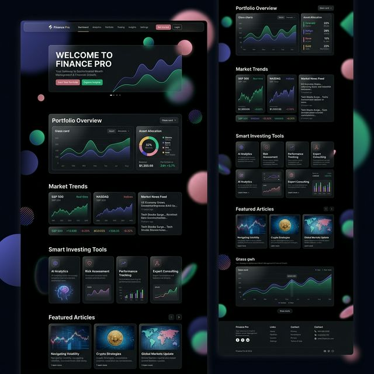

# 💰 Finance Pro - "Sober Dark" Financial Management


## 🌟 La Plataforma
**Finance Pro** no es solo otro gestor de finanzas. Es una herramienta diseñada con una estética **Sober Dark** para aquellos que buscan control total sobre sus activos con una interfaz elegante, rápida y profesional.

Desde el rastreo de inversiones hasta la gestión de presupuestos recurrentes, cada píxel ha sido pulido para ofrecer una experiencia premium.

---

## ✨ Características Principales

### 📊 Dashboard Dinámico
Visualiza tu salud financiera de un vistazo con gráficos interactivos y métricas en tiempo real.


### 🏨 Landing Page de Alto Nivel
Una primera impresión que cautiva, diseñada para convertir y explicar el valor de la plataforma de forma visual.


### 🛠️ Herramientas de Administración
Panel de control completo para gestionar usuarios, planes y seguridad del sistema.

- **Modo Demo**: Prueba la plataforma al instante sin registros permanentes.
- **Gestión de Planes**: Diferenciación clara entre tiers (Free, Pro, Elite).
- **Seguridad**: Autenticación robusta con JWT y cifrado de claves.

---

## 🚀 Stack Tecnológico

| Capa | Tecnologías |
| :--- | :--- |
| **Frontend** | Next.js 14, Tailwind CSS, Framer Motion, Recharts |
| **Backend** | NestJS, Passport JWT, TypeScript |
| **Base de Datos** | SQL Server, Prisma ORM |

---

## 🛠️ Instalación y Configuración

Sigue estos pasos para levantar el proyecto localmente:

### 1. Clonar el repositorio
```bash
git clone https://github.com/elnames/Finance-Pro.git
cd Finance-Pro
```

### 2. Configurar el Backend
```bash
cd backend
npm install
# Configura tu .env con DATABASE_URL y JWT_SECRET
npx prisma generate
npm run start:dev
```

### 3. Configurar el Frontend
```bash
cd ../frontend
npm install
npm run dev
```

---

## 🎨 Principios de Diseño
- **Estética Sober Dark**: Uso de paletas Zinc y Slate para un look profesional.
- **Micro-animaciones**: Transiciones suaves con Framer Motion.
- **Responsive Design**: Experiencia fluida desde móviles hasta monitores ultrawide.

---

## 📜 Licencia
Este proyecto está bajo la Licencia MIT.

---
*Desarrollado con ❤️ para el mundo de las finanzas.*
